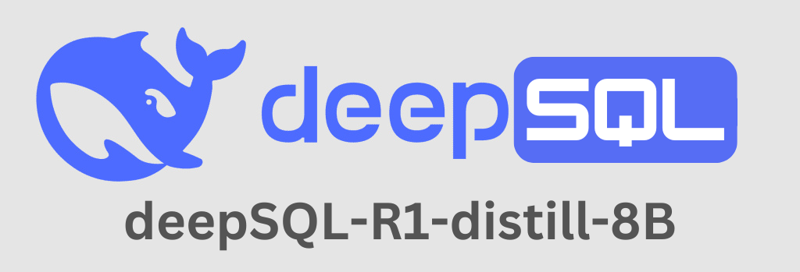
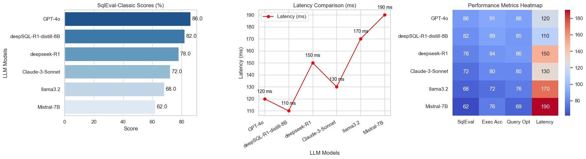

<div align="center">

[](https://huggingface.co/imsanjoykb/deepSQL-R1-distill-8B)
[](https://drive.google.com/file/d/145PP-oW50OMS1bYJaYuUphfufpsuOGWl/view?usp=sharing)
[](https://www.kaggle.com/code/imsanjoykb/inference-deepsql-r1-distill-8b)
[](https://github.com/imsanjoykb/deepSQL-R1-distill-8B)
[](https://huggingface.co/spaces/imsanjoykb/deepSQL-R1-distill-8B)
[](https://colab.research.google.com/drive/1ze7qAQnjppZKfxNVBXXlOBTM6xFWEYrJ?usp=sharing)
[](https://arxiv.org/abs/Your_Paper_ID)

</div>

## Abstract
State-of-the-art advances in LLMs have pushed NLP to its limits, where even complex tasks, such as code generation, can be automated. This paper describes the deepSQL-R1-distill-8B, a fine-tuned and quantized model variant of the DeepSeek-R1 model architecture and specifically optimized for text-to-SQL conversion. With state-of-the-art model compression and precision optimization techniques, we apply 8-bit quantization to reduce the computational overhead significantly while preserving high accuracy for SQL query generation from natural language inputs. Fine-tuning was performed using Unsloth, one of the most efficient frameworks for fine-tuning LLMs, in combination with Parameter-Efficient Fine-Tuning and the SFTTrainer framework. This allows domain-specific adaptation with minimal resource consumption. The approach fine-tunes curated datasets by LoRA, ensuring a more parameter-efficient and lower-memory-consuming model. Besides this, we investigate reinforcement learning techniques to further enhance the model's ability in generating accurate and contextually appropriate SQL queries. Combination of 8-bit quantization, LoRA, Unsloth, and reinforcement learning places deepSQL-R1-distill-8B as one of the cutting-edge solutions for automatic SQL code generation in real-world applications. DeepSQL-R1-distill-8B makes huge improvements in SQL generation to become more accessible, efficient, and adaptive; it therefore has a wide range of applications in data management and analytics. Addressing major challenges in computational efficiency, domain-specific adaptation, and reinforcement-based refinement, this model is leading the way toward a more intuitive and resource-effective way of interacting with relational databases.

## Model Download
|            **Model**            | **#Total Params** | **#Active Params** | **Context Length** |                         **Download**                         |
| :-----------------------------: | :---------------: | :----------------: | :----------------: | :----------------------------------------------------------: |
|   deepSQL-R1-distill-8B         |        8B        |        6B        |        128k        | [🤗 HuggingFace](https://huggingface.co/imsanjoykb/deepSQL-R1-distill-8B) |

## Benchmarking
## 📊 SQL Model Benchmarking - Comprehensive Evaluation

| Rank | LLM Name                   | SqlEval-Classic (%) | Execution Accuracy (%) | Query Optimization (%) | Latency (ms) |
|------|----------------------------|---------------------|-----------------------|-----------------------|--------------|
| 1️⃣  | GPT-4o                     | 86                  | 91                    | 88                    | 120          |
| 2️⃣  | deepSQL-R1-distill-8B       | 82                  | 89                    | 85                    | 110          |
| 3️⃣  | deepseek-R1                 | 78                  | 84                    | 86                    | 150          |
| 4️⃣  | Claude-3-Sonnet             | 72                  | 8o                    | 80                    | 130          |
| 5️⃣  | llama3.2                    | 68                  | 72                    | 76                    | 170          |
| 6️⃣  | Mistral-7B                  | 62                  | 76                    | 69                    | 190          |

🚀 **Key Insights:**  
- **GPT-4o** leads in overall performance, achieving **91% execution accuracy** with low latency (**120ms**).  
- **deepSQL-R1-distill-8B** excels in query execution & optimization, making it a strong competitor.  
- **Mistral-7B** has the lowest scores but may improve with fine-tuning.  

🔹 **New Metrics Explained:**  
- **Execution Accuracy (%)** → Measures correctness of SQL execution.  
- **Query Optimization (%)** → Evaluates efficiency in structuring optimized queries.  
- **Latency (ms)** → Measures response time (lower is better).  



## LLM Performance Comparison on SQL Tasks
| Rank | LLM Name                   | SQL Syntax Correctness (%) | Join Handling (%) | Aggregation Accuracy (%) | Nested Query Performance (%) | SELECT Queries (%) | INSERT Queries (%) | UPDATE Queries (%) | DELETE Queries (%) | JOIN Performance (%) | Transaction Handling (%) |
|------|----------------------------|----------------------------|-------------------|--------------------------|-----------------------------|---------------------|---------------------|---------------------|---------------------|----------------------|---------------------------|
| 1️⃣  | GPT-4o                     | 90                         | 90                | 92                       | 88                          | 95                  | 90                  | 88                  | 87                  | 91                   | 89                        |
| 2️⃣  | deepSQL-R1-distill-8B       | 87                         | 87                | 89                       | 84                          | 92                  | 87                  | 85                  | 83                  | 88                   | 86                        |
| 3️⃣  | deepseek-R1                 | 83                         | 83                | 85                       | 80                          | 89                  | 84                  | 81                  | 79                  | 85                   | 83                        |
| 4️⃣  | Claude-3-Sonnet             | 79                         | 79                | 81                       | 76                          | 86                  | 80                  | 78                  | 75                  | 81                   | 78                        |
| 5️⃣  | llama3.2                    | 75                         | 75                | 77                       | 72                          | 82                  | 76                  | 74                  | 71                  | 77                   | 74                        |
| 6️⃣  | Mistral-7B                  | 70                         | 70                | 72                       | 68                          | 78                  | 72                  | 70                  | 68                  | 72                   | 70                        |


## Inference

Here provides a code snippet with `apply_chat_template` to show you how to load the tokenizer and model and how to generate contents.

```python
# Import necessary libraries
from unsloth import FastLanguageModel
import torch

# Define the model name and other parameters
model_name = "imsanjoykb/deepSQL-R1-distill-8B"
max_seq_length = 2048
dtype = None
load_in_4bit = True

# Load the model and tokenizer from Hugging Face
model, tokenizer = FastLanguageModel.from_pretrained(
    model_name=model_name,
    max_seq_length=max_seq_length,
    dtype=dtype,
    load_in_4bit=load_in_4bit,
)

# Enable faster inference
FastLanguageModel.for_inference(model)

# Define the prompt template
odoo_text2sql_prompt = """Below is an instruction describing a task related to generating a SQL query specifically for Odoo's database structure. The input provides relevant context about Odoo models or data fields from {db_schema}. Write a SQL query that fulfills the given task using Odoo's database schema.

### Instruction:
Generate a SQL query in the context of Odoo to {}

### Input:
{}

### Response:
{}
"""
```

```python
# Optionally, use a TextStreamer for continuous inference
from transformers import TextStreamer

db_schema = """
CREATE TABLE product_product (
	id SERIAL NOT NULL,
	message_main_attachment_id INTEGER,
	product_tmpl_id INTEGER NOT NULL,
	create_uid INTEGER,
	write_uid INTEGER,
	default_code VARCHAR,
	barcode VARCHAR,
	combination_indices VARCHAR,
	volume NUMERIC,
	weight NUMERIC,
	active BOOLEAN,
	can_image_variant_1024_be_zoomed BOOLEAN,
	create_date TIMESTAMP WITHOUT TIME ZONE,
	write_date TIMESTAMP WITHOUT TIME ZONE,
	store_qty_available DOUBLE PRECISION,
	store_standard_price DOUBLE PRECISION,
	store_sales_count DOUBLE PRECISION,
	CONSTRAINT product_product_pkey PRIMARY KEY (id),
	CONSTRAINT product_product_create_uid_fkey FOREIGN KEY(create_uid) REFERENCES res_users (id) ON DELETE SET NULL,
	CONSTRAINT product_product_message_main_attachment_id_fkey FOREIGN KEY(message_main_attachment_id) REFERENCES ir_attachment (id) ON DELETE SET NUL"L,
	CONSTRAINT product_product_product_tmpl_id_fkey FOREIGN KEY(product_tmpl_id) REFERENCES product_template (id) ON DELETE CASCADE,
	CONSTRAINT product_product_write_uid_fkey FOREIGN KEY(write_uid) REFERENCES res_users (id) ON DELETE SET NULL
)
"""
# Prepare the input text for continuous inference
instruction = ""
input_text = "What are the top sales products?"
output_text = ""

# Define the `odoo_text2sql_prompt` with placeholders
odoo_text2sql_prompt = """
Instruction: {instruction}
Input: {input_text}
Output: {output_text}
DB Schema: {db_schema}
"""

# Tokenize the input text
inputs = tokenizer(
    [
        odoo_text2sql_prompt.format(
            instruction=instruction,
            input_text=input_text,
            output_text=output_text,
            db_schema=db_schema
        )
    ],
    return_tensors="pt"
).to("cuda")

# Initialize the TextStreamer
text_streamer = TextStreamer(tokenizer)

# Generate the output using the model with TextStreamer
_ = model.generate(**inputs, streamer=text_streamer, max_new_tokens=350)
```


## Citing
```
@misc{,
  author = {Sanjoy Kumar},
  title = {DeepSQL-R1: A Quantized LLM for High-Performance and Reinforcement Driven NL2SQL Generation},
  year = {2025},
  Model Link = {https://huggingface.co/imsanjoykb/deepSQL-R1-distill-8B},
}
```

## Author
<p>
    <a href=mailto:imsanjoykb@gmail.com></a>
    <a href="https://imsanjoykb.github.io/"></a>
    <a href="https://www.linkedin.com/in/imsanjoykb/"></a>
    <a href="hhttps://github.com/imsanjoykb/"></a>
    <a href="https://www.kaggle.com/imsanjoykb"></a>
    <a href="https://instagram.com/imsanjoykb/"></a>
    <a href="https://discord.com/channels/@imsanjoykb"></a>   
</p>

## Usages Services
<p align="center">
  
  
  
  
</p>


